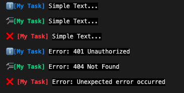

# **@iamyth/logger**

A nice console logger which makes your message look fantastic.

## **Installation**

```bash
$ yarn add -D @iamyth/logger
// or
$ npm install -D @iamyth/logger
```

## **Usage**

```typescript
import { createConsoleLogger } from '@iamyth/logger';

const myLogger = createConsoleLogger('My Task');

// Log simple Text, or accept Array of string
myLogger.info('Simple Text...');
myLogger.task(['Simple Text...']);
myLogger.error('Simple Text...');

// Log JavaScript Error, or accept Array of Error
myLogger.info(new Error('401 Unauthorized'));
myLogger.task([new Error('404 Not Found')]);
myLogger.error([new Error('Unexpected error occurred')]);
```


